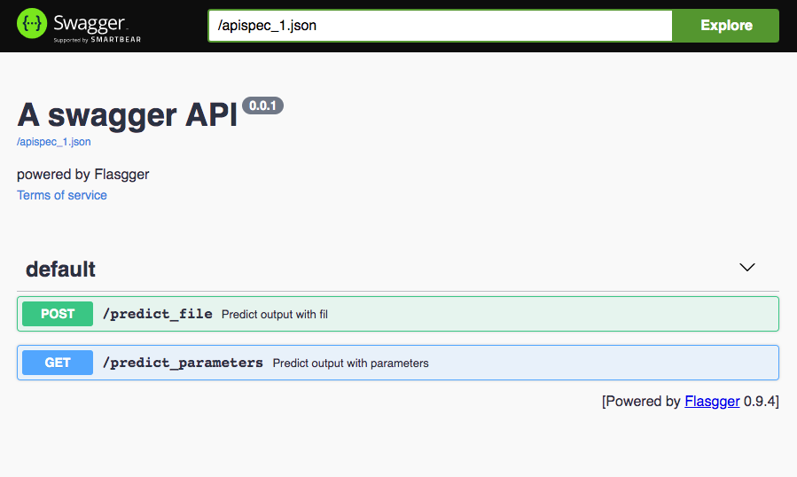

# Retail Data App
Flask - Flasgger - Docker - Kubernetes - Machine Learning Application

# About this Project

This project is a Machine Learning Application to perform sales forecasting with a regression model and integrate the model with a web interface. 

## Screenshots 

## Getting Started

The main goal of this project is to build a complete machine learning application, from the model selection to deployment. The tutorial is explained in a series of articles (Portuguese) describing each step. 

### Articles: 

- [Model](https://medium.com/@eduardo.p.domingues/da-modelagem-ao-deploy-modelos-691e87422007)
- [Flask API](https://medium.com/@eduardo.p.domingues/da-modelagem-ao-deploy-api-10788ef3a5f3)
- [Flasgger](https://medium.com/@eduardo.p.domingues/da-modelagem-ao-deploy-front-end-8f7cd02bd91c)
- [Containers](https://medium.com/@eduardo.p.domingues/da-modelagem-ao-deploy-containers-4facb34312cf)

### Running the code

To run the code you should have Docker installed so you'll be able to generate a container and run the app. 
[Docker Installation](https://docs.docker.com/get-docker/)

In Terminal, navigate to the app folder and run the following commands: 
- $ docker build docker build -t [app_name] -f Dockerfile.txt .
- $ docker run -d -p 8091:8000 [app_name]

And access the application in your localhost port 8091. 

### Functionalities 

There are two methods of predicting sales, GET and, POST. The model was trained using information about Department 1 of Store 1. The test data frame was exported with the name of test.csv and should be used in the POST method. To test the GET method, the only parameter you must set to 1 is the department. Be aware that the model was trained using specific information from both the department and the store. So, anything that deviates too much from that information might lead to a poor prediction. 

## Author
Eduardo Domingues - [Git](https://github.com/eduardopd)

